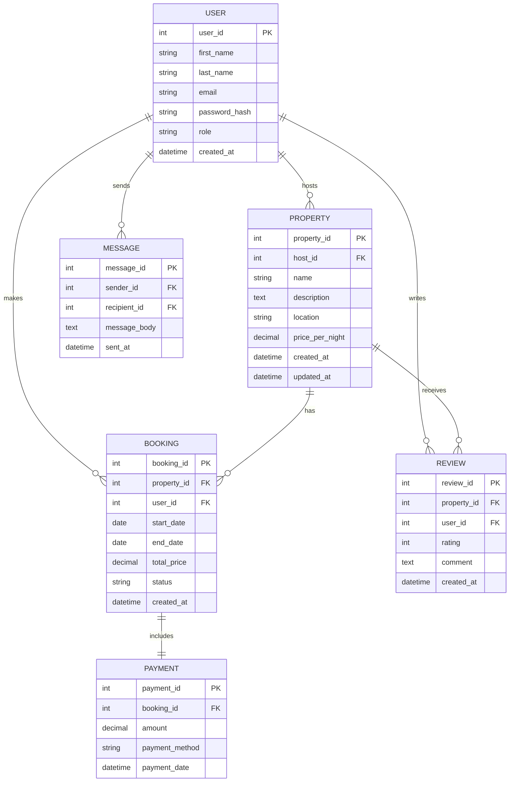

# Entity Relationship Diagram (ERD)

## Entities and Attributes

### User
- **user_id**: Integer, M, PK  
- **first_name**: Varchar(50), M  
- **last_name**: Varchar(50), M  
- **email**: Varchar(50), M  
- **password_hash**: Varchar(50), M  
- **role**: Varchar(10), M  
- **created_at**: Timestamp, M  

### Property
- **property_id**: Integer, M, PK  
- **host_id**: Integer, M, FK  
- **name**: Varchar(50), M  
- **description**: Text(100), M  
- **location**: Varchar(50), M  
- **price_per_night**: Decimal(10, 2), M  
- **created_at**: Timestamp, M  
- **updated_at**: Timestamp, M  

### Booking
- **booking_id**: Integer, M, PK  
- **property_id**: Integer, M, FK  
- **user_id**: Integer, M, FK  
- **start_date**: Date, M  
- **end_date**: Date, M  
- **total_price**: Decimal(10, 2), M  
- **status**: Varchar(10), M  
- **created_at**: Timestamp, M  

### Payment
- **payment_id**: Integer, M, PK  
- **booking_id**: Integer, M, FK  
- **amount**: Decimal(10, 2), M  
- **payment_method**: Varchar(10), M  
- **payment_date**: Timestamp, M  

### Review
- **review_id**: Integer, M, PK  
- **property_id**: Integer, M, FK  
- **user_id**: Integer, M, FK  
- **rating**: Integer, M  
- **comment**: Text(100), M  
- **created_at**: Timestamp, M  

### Message
- **message_id**: Integer, M, PK  
- **sender_id**: Integer, M, FK  
- **recipient_id**: Integer, M, FK  
- **message_body**: Text(200), M  
- **sent_at**: Timestamp, M  

---

## Relationships

| Relationship | Type | Description | Foreign Key | Cardinality |
|---------------|------|--------------|--------------|--------------|
| User ↔ Property | One-to-Many | A User (host) can own multiple Properties | Property.host_id → User.user_id | 1 ↔ 0..* |
| User ↔ Booking | One-to-Many | A User (guest) can make multiple Bookings | Booking.user_id → User.user_id | 1 ↔ 0..* |
| Property ↔ Booking | One-to-Many | A Property can have multiple Bookings | Booking.property_id → Property.property_id | 1 ↔ 0..* |
| Booking ↔ Payment | One-to-One | Each Booking has one Payment | Payment.booking_id → Booking.booking_id | 1 ↔ 0..1 |
| Property ↔ Review | One-to-Many | A Property can have multiple Reviews | Review.property_id → Property.property_id | 1 ↔ 0..* |
| User ↔ Review | One-to-Many | A User can write multiple Reviews | Review.user_id → User.user_id | 1 ↔ 0..* |
| User ↔ Message (Sender) | One-to-Many | A User can send multiple Messages | Message.sender_id → User.user_id | 1 ↔ 0..* |
| User ↔ Message (Recipient) | One-to-Many | A User can receive multiple Messages | Message.recipient_id → User.user_id | 1 ↔ 0..* |

---

## Diagram Representation

Below is the ER diagram showing the main entities and their relationships.

